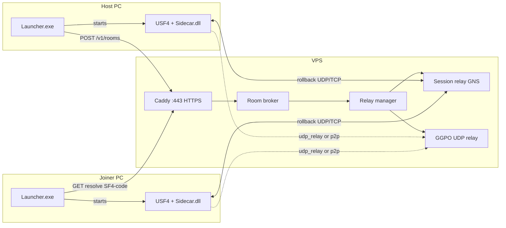
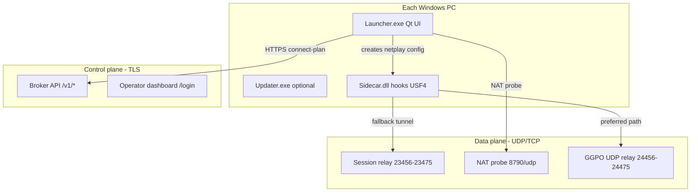
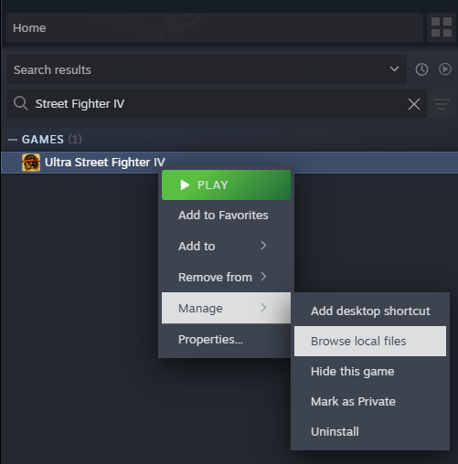

# SF4 Netplay Launcher

> **Unofficial experimental port** - **not** the official [sf4e](https://codeberg.org/adanducci/sf4e) project by **[Anthony Danducci](https://codeberg.org/adanducci/sf4e)**. Anthony Danducci does not maintain, endorse, or support this build. This is **not production-ready software** - a friends-only experiment built on upstream sf4e (MIT). See [ATTRIBUTION.md](ATTRIBUTION.md) and [docs/SCOPE_AND_LIMITATIONS.md](docs/SCOPE_AND_LIMITATIONS.md).

**SF4 Netplay Launcher** is a **third-party, experimental unofficial port** for _Ultra Street Fighter IV_ on Steam. It adds a native **Qt Host / Join / Offline** launcher and **VPS relay room codes** (`SF4-XXXX`) on top of sf4e's rollback netplay. Netplay may fail, desync, or break between releases - use only with people who accept that risk.

**Latest release:** [v0.4.1](https://github.com/Confetti3/SF4-Netplay-Launcher/releases/tag/v0.4.1) (netplay stability + connectivity improvements)

**Download:** [GitHub Releases — Latest](https://github.com/Confetti3/SF4-Netplay-Launcher/releases/latest) — asset `sf4-netplay-launcher-*-v0.4.1.zip` (not "Source code" only).

## How it works

Simple mode (default) uses a **shared VPS** so the host does not port-forward. Each player runs the same release zip. The launcher handles room codes over **HTTPS**; game rollback traffic uses **UDP/TCP** relay ports on the VPS (not TLS - that is normal for real-time netplay).

### End-to-end flow (Simple mode)



**Typical session**

1. **Host** clicks Host, then **Get code** - launcher calls the broker over HTTPS and receives `SF4-XXXX`, a session relay port, and (when VPS transport is `auto`) a GGPO UDP relay port.
2. **Joiner** pastes the code - launcher resolves it on the broker (HTTPS).
3. Both click **Start game** - launcher fetches a **connect-plan**, runs a **NAT probe** (`8790/udp`), registers each player's GGPO endpoint, and injects `Sidecar.dll` with `NetplayConfig` (room token, relay host/ports, transport hint).
4. **Sidecar** picks the best path: **p2p** (same public IP or punchable NAT), else **udp_relay** (direct GGPO via VPS), else **legacy_session_tunnel** (GGPO inside the GNS session relay). Legacy always works as fallback.
5. In-game lobby: Ready, character select, fight.

### What runs where



| Layer | Protocol | Purpose |
|-------|----------|---------|
| Room create/join, connect-plan | **HTTPS** (443) | Room codes, secrets, match metadata |
| GGPO UDP relay (preferred) | **UDP** (24456+) | Direct GGPO when broker transport is `auto` |
| Session relay (fallback) | **UDP+TCP** (23456+) | Rollback frames via GNS tunnel |
| NAT probe | **UDP** (8790) | Public endpoint discovery for connect-plan / P2P |

Broker, relay-manager, and dashboard listen on **127.0.0.1** on the VPS; only Caddy and game ports are public. See [docs/VPS_TLS_SETUP.md](docs/VPS_TLS_SETUP.md).

### Transport modes (v0.3.6)

Production VPS uses **`BROKER_GGPO_TRANSPORT=auto`**. Each room gets a session relay plus a GGPO UDP relay. The client tries faster paths first:

```
p2p -> udp_relay -> legacy_session_tunnel (always available fallback)
```

**v0.3.6** keeps **UDP relay** across rematches in the same room (relay re-binds slots; client preserves broker endpoint after fallback). Override with `SF4E_GGPO_TRANSPORT=legacy|udp|p2p|auto` (optional). Details: [docs/TRANSPORT_REGRESSION.md](docs/TRANSPORT_REGRESSION.md).

## Demo

Experimental Simple-mode netplay (Host -> room code -> Join -> fight). This is a **friends-only test build**, not production-ready software.

https://github.com/user-attachments/assets/1750fc8c-6f04-410c-8820-ec59638107f5

Full quality: [`docs/demo/SF4Demo.mp4`](docs/demo/SF4Demo.mp4) (~34 MB)

[Download full demo (MP4)](https://github.com/Confetti3/SF4-Netplay-Launcher/releases/download/v0.2.8.1/SF4Demo.mp4)

[TOC]

## Getting started

### 1. Prerequisites

Install once on each PC:

| Requirement | Link |
|-------------|------|
| **Ultra Street Fighter IV** (Steam, app 45760) | Not included in the zip |
| **Qt 6 runtime** (included in release zip) | `Qt6Core/Gui/Widgets.dll` + `plugins/` — no separate install |
| [VC++ Redistributable (x86)](https://aka.ms/vs/17/release/vc_redist.x86.exe) | Required for sf4e binaries |

### 2. Install

1. Download the latest **team zip** from [Releases](https://github.com/Confetti3/SF4-Netplay-Launcher/releases/latest).
2. Extract the **entire** zip to one folder (e.g. `C:\Games\SF4-Netplay-Launcher\`). Keep all files together - do not copy only `Launcher.exe`.
3. Optional: run `preflight.cmd` to verify the package.
4. Double-click **`Launcher.exe`**.

Both players must use the **same release zip** (`Sidecar.dll` must match). The launcher header shows your installed version (e.g. `v0.4.1`). Use **Check for updates** on the home screen to upgrade.

### 3. Play online (Simple mode - experimental)

The launcher defaults to **Simple mode**. This path is **experimental** - it has worked in small tests but is not guaranteed. No router setup on the host PC when the VPS relay path works.

| Step | Host | Joiner |
|------|------|--------|
| 1 | Click **Host** -> **Get code** | Wait |
| 2 | Copy the **`SF4-XXXX`** code shown on screen | Click **Join** -> paste that exact code |
| 3 | Click **Start game** | Wait until host is in-game, then **Start game** |
| 4 | Press **Ready** in the in-game lobby | Press **Ready** |
| 5 | Pick characters and fight | Same |

**Tips**

- Share the **current** room code from the host screen - old codes point at empty or expired sessions.
- Stay in **Simple mode** for testing with friends. **Find match** and **Open rooms** (Advanced only) are more experimental still.
- If USF4 is not detected automatically, set `STEAM_APP_PATH` to your `Super Street Fighter IV - Arcade Edition` folder before launching.

### 4. Advanced mode (Direct IP)

Switch to **Advanced** in the launcher for classic host/join with `IP:port`, local relay, or UPnP. The host must **port-forward TCP+UDP** on the session port (default **23456**). See [docs/USER_NETPLAY.md](docs/USER_NETPLAY.md).

Direct IP behavior is unchanged from v0.2.6 - use Advanced when you prefer port-forward over VPS room codes.

## Scope and limitations

This is an **experimental unofficial port** for a **small friends group** - not official sf4e, not a public matchmaking service, and **not presented as finished or production-ready software**.

| In scope | Out of scope / limits |
|----------|------------------------|
| USF4 on **Steam**, **Windows 10+** | Game not included; no console/macOS native build |
| **Simple mode**: VPS room codes (`SF4-XXXX`), no host port forward | **~20 rooms** on default broker; rooms expire after **~15 min** idle |
| **Advanced mode**: Direct IP / UPnP / custom broker | Direct IP host must **port-forward** TCP+UDP (default **23456**) |
| Same **release zip** on all players | **Find match** / **Open rooms** are **experimental** |
| Unofficial launcher + packaging on upstream sf4e (MIT) | **Not** maintained or endorsed by Anthony Danducci |

**Less tested:** disconnect recovery, spectator mode, Linux/Proton. **Rematch** in the same VPS room is supported in v0.3.6+ (UDP relay re-registration).

Full details: [docs/SCOPE_AND_LIMITATIONS.md](docs/SCOPE_AND_LIMITATIONS.md) (also in the release zip).

## Documentation

| Doc | Audience |
|-----|----------|
| [docs/VPS_TLS_SETUP.md](docs/VPS_TLS_SETUP.md) | VPS TLS, firewall, and port layout |
| [docs/TRANSPORT_REGRESSION.md](docs/TRANSPORT_REGRESSION.md) | Transport ladder test matrix |
| [docs/BETA_TESTERS.md](docs/BETA_TESTERS.md) | Experimental testers - quick checklist and bug reports |
| [docs/USER_NETPLAY.md](docs/USER_NETPLAY.md) | Player guide - Simple + Advanced flows |
| [docs/TEAM_QUICKSTART.md](docs/TEAM_QUICKSTART.md) | Packaged as `START_HERE.md` in the release zip |
| [docs/SMOKE_TEST.md](docs/SMOKE_TEST.md) | Manual test checklist |
| [docs/SCOPE_AND_LIMITATIONS.md](docs/SCOPE_AND_LIMITATIONS.md) | What this port is for, and known limits |
| [ATTRIBUTION.md](ATTRIBUTION.md) | Upstream sf4e credit (Anthony Danducci) |
| [SECURITY.md](SECURITY.md) | Security policy and supported versions |
| [docs/RELEASE.md](docs/RELEASE.md) | Building and publishing releases |
| [docs/TROUBLESHOOTING.md](docs/TROUBLESHOOTING.md) | Player troubleshooting — black launcher, crash on launch, settings, Direct IP |
| [docs/WINDOWS_DEFENDER.md](docs/WINDOWS_DEFENDER.md) | Defender false positives (`Wacapew.A!ml`) |
| [docs/RELEASE_NOTES_v0.3.8.md](docs/RELEASE_NOTES_v0.3.8.md) | Latest release notes (draft for next tag) |
| [docs/SIGNPATH_APPLY.md](docs/SIGNPATH_APPLY.md) | SignPath Foundation checklist |

## Troubleshooting

See **[docs/TROUBLESHOOTING.md](docs/TROUBLESHOOTING.md)** for the full guide (black launcher, crash on **Start game**, recommended settings, Direct IP, logs). Release history: [GitHub Releases](https://github.com/Confetti3/SF4-Netplay-Launcher/releases).

**Report bugs:** Git line from `BUILD_INFO.txt`, both players' `sf4e.log`, steps to reproduce — [docs/BETA_TESTERS.md](docs/BETA_TESTERS.md).

## Configuration

| Setting | How |
|---------|-----|
| Broker URL | Advanced -> **Room broker URL**, or `set SF4E_BROKER_URL=https://74-208-200-95.nip.io` |
| Developer overlay | `Launcher.exe --dev-overlay` or `set SF4E_NETPLAY_DEV=1` |
| Offline (no netplay) | **Offline** on the launcher home screen |
| Reset stuck settings | Delete or edit `%APPDATA%\sf4e\config.json` |

Default broker: `https://74-208-200-95.nip.io` (HTTPS via Caddy; no host port forward in Simple mode).

## For developers

This repository builds **SF4 Netplay Launcher** - an **unofficial port** of upstream [sf4e](https://codeberg.org/adanducci/sf4e) by Anthony Danducci (MIT). The launcher, broker tooling, and packaging are maintained here; Anthony Danducci maintains official sf4e on Codeberg.

**Publish a release:**

```powershell
powershell -NoProfile -File scripts/release-team-build.ps1 -VersionLabel 0.3.6
gh release create v0.3.8 dist/sf4-netplay-launcher-*-0.3.8.zip --title "SF4 Netplay Launcher v0.3.8" --notes-file docs/RELEASE_NOTES_v0.3.8.md
```

See [docs/RELEASE.md](docs/RELEASE.md).

### Supported environments

* Windows: Windows 10 or later
* Linux: Fedora 40+, Steam Deck (via Proton)

### Running on Windows

Windows users with a working Steam installation can run the launcher by extracting a release zip and double-clicking `Launcher.exe`. The launcher attempts to detect your SF4 installation automatically. Windows users with uncommon or damaged Steam installations may set the `STEAM_APP_PATH` environment variable to the absolute path of the `Super Street Fighter IV - Arcade Edition` directory installed by Steam. You can navigate to this directory using the Steam library's context menu by right-clicking on Ultra Street Fighter IV's library entry, hovering over "Manage", then selecting "Browse local files", as shown below.



### Running on Linux

The most straightforward way to launch on Linux is with [protontricks](https://github.com/Matoking/protontricks). Extract the release, then run `protontricks-launch Launcher.exe` and select SF4 from the popup UI. For convenience, `protontricks-launch --appid 45760 Launcher.exe` can be used to launch non-interactively, e.g. from shell scripts or program shortcuts.

Linux users who do not install `protontricks` may set the `STEAM_APP_PATH` environment variable to the path of the `Super Street Fighter IV - Arcade Edition` directory installed by Steam, as demonstrated above. Users should take care to ensure the variable points to a Windows-formatted path accessible from within the Proton container for SF4, and it may be helpful to take advantage of Wine providing the Linux system root as the `Z:` root inside Wine to specify the path. For example, if the local directory is available at `/home/steamdeck/.local/share/Steam/steamapps/common/Super Street Fighter IV - Arcade Edition`, the corresponding path through the Proton container would be `Z:\\home\\steamdeck\\.local\\share\\Steam\\steamapps\\common\\Super Street Fighter IV - Arcade Edition`.

## Building

The codebase inherits from upstream **sf4e** and is built primarily with [Visual Studio](https://visualstudio.microsoft.com/)
2019 16.10 or later with Visual C++. Other development environments will need
support for installing dependencies, ideally via [vcpkg](https://vcpkg.io/en/index.html)
and build file generation via [CMake](https://cmake.org/).

To build with VS2019 16.10+:

1. Follow steps 1 and 2 in [`vcpkg`'s Getting Started guide](https://learn.microsoft.com/en-us/vcpkg/get_started/get-started),
   stopping after `vcpkg` has been bootstrapped.
   - You can stop at step 3 - this repo already has a manifest file.
2. Set up a local `CMakeUserPresets.json` to describe your environment.
   The following can be used as a quickstart, making sure to provide the
   path to the copy of `vcpkg` checked out in step 1: 
```
{
    "version": 2,
    "configurePresets": [
      {
        "name": "default",
        "inherits": "x86-msvc-ninja-relwithdebinfo",
        "environment": {
          "VCPKG_ROOT": "C:/Users/myuser/path/to/vcpkg"
        }
      }
    ]
  }
  
```
   - Since SF4 is a 32-bit executable, binaries and dependencies
     (most importantly Detours) also need to be built targeting a
     32-bit host to properly hook SF4's instructions.
3. Open `CMakeLists.txt` with VS2019's native CMake integration.
   - Ensure [CMakePresets.json integration in Visual Studio](https://learn.microsoft.com/en-us/cpp/build/cmake-presets-vs?view=msvc-170#enable-cmakepresets-json-integration) is enabled.
4. Run `Build All`. Confirm that `Launcher.exe` and `Sidecar.dll` are in
   the build output.
5. Run `Launcher.exe`.

To build with the CMake command line:

1. Set up `vcpkg`, as above in step 1.
2. Set up a local `CMakeUserPresets.json` to describe your environment,
   as above in step 2.
3. Using a CLI environment with CMake and a compiler prepared, run
   `cmake --preset default` from the root of the repository.
   - VS users may wish to use either the x86 Native Tools or the
     x64_x86 Cross Tools developer command prompts, as they already
     provide tools like Ninja and Cmake, and have the various environment
     variables used by CMake already prepared.
4. Build by running `cmake --build ./path-to-binary-dir/` from the root
   of the repository. Confirm that `Launcher.exe` and `Sidecar.dll` are in
   the build output.
   * If a `CMakeUserPresets.json` file like the one in step 2 is used, the
     the binary dir is `./msvc-build/default`.
5. Run `Launcher.exe`.

Builds generated with CMake that cannot take advantage of `vcpkg` will need to
provide the following dependencies:

* [Detours](https://github.com/microsoft/Detours). Detours is used to install
  custom netplay hooks at runtime.
* [ValveFileVDF](https://github.com/TinyTinni/ValveFileVDF). ValveFileVDF
  is used to parse Steam's configuration files, to automatically detect
  your installation of SF4.
* [Dear Imgui](https://github.com/ocornut/imgui). Dear Imgui is used to
  provide custom overlays for new features and non-durable,
  development-time debugging.
* [spdlog](https://github.com/gabime/spdlog). `spdlog` is used to provide
  durable file logging, both at development time and in release builds.
* [nlohmann/json](https://github.com/nlohmann/json). `json` is used for
  message serialization.
* [GameNetworkingSockets](https://github.com/ValveSoftware/GameNetworkingSockets/).
  `GamenNetworkingSockets` provides a very helpful high-level API on top
  of message passing, and additionally supports NAT hole punching if
  a signalling server is run.
* [GGPO](https://github.com/pond3r/ggpo), used to provide rollback.

## License

This project is licensed under the MIT License - see the LICENSE.md file for details.

## External Licenses and Copyright Information

Street Fighter, Street Fighter 4, Ultra Street Fighter 4, and all related software
Copyright (c) CAPCOM.

Steam
Copyright (c) Valve Corporation.

Visual Studio, Visual Studio 2019, vcpkg, and Detours
Copyright (c) Microsoft Corporation.

CMake - Cross Platform Makefile Generator
Copyright (c) Kitware, Inc. and Contributors.

ValveFileVDF
Copyright (c) Matthias Moeller.

Dear Imgui
Copyright (c) Omar Cornut

spdlog
Copyright (c) 2016 Gabi Melman.

nlohmann/json
Copyright (c) 2013-2022 Niels Lohmann

GameNetworkingSockets
Copyright (c) 2018, Valve Corporation

GGPO (Good Game Peace Out)
Copyright (c) GroundStorm Studios, LLC.
